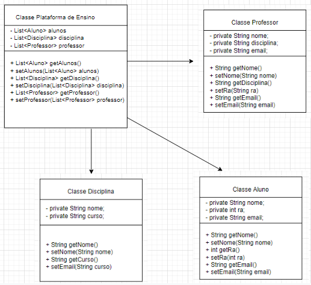

# Atividade 1
Within Google, we sometimes say, “Software engineering is programming integrated over time.” Programming is certainly a significant part of software : engineering after all, programming is how you generate new software in the first place. If you accept this distinction, it also becomes clear that we might need to delineate between programming tasks (development) and software engineering tasks (development, modification, maintenance). The addition of time adds an important new dimension to programming. Cubes aren’t squares, distance isn’t velocity. Software engineering isn’t programming.

We see three critical differences between programming and software engineering: time, scale, and the trade-offs at play. On a software engineering project, engineers need to be more concerned with the passage of time and the eventual need for change. In a software engineering organization, we need to be more concerned about scale and efficiency, both for the software we produce as well as for the organization that is producing it. Finally, as software engineers, we are asked to make more complex decisions with higher-stakes outcomes, often based on imprecise estimates of time and growth.

Link para o livro: https://abseil.io/resources/swe-book
A Engenharia de Software é mais ampla que a Programação. Ela cobre todo o ciclo de vida do software, desde o planejamento até a manutenção. Aqui estão as etapas principais:
- Análise de Requisitos: Entender o que os usuários e partes interessadas precisam.
- Projeto de Software: Planejar a estrutura, funcionalidades, interfaces e componentes do software.
- Implementação: Escrever o código conforme o projeto.
- Testes: Verificar a qualidade do software.
- Manutenção: Corrigir erros e atualizar o software conforme necessário.
- Gerenciamento de Projetos: Planejar e controlar o desenvolvimento do software.
Diferenças Entre Engenharia de Software e Programação
1. Tempo:
- Programação: Foca na criação do software em um momento específico, sem considerar mudanças futuras.
- Engenharia de Software: Considera todo o ciclo de vida do software, desde a criação até a evolução e manutenção.
2. Escala:
- Programação: Geralmente aplicada a projetos menores e funcionalidades específicas.
- Engenharia de Software: Envolve projetos grandes e complexos, necessitando de eficiente gerenciamento de recursos.
3. Tomada de Decisões:
- Programação: Baseia-se em requisitos bem definidos com menos incerteza.
- Engenharia de Software: Envolve decisões complexas em cenários incertos, exigindo boas habilidades analíticas.
A Engenharia de Software se destaca por sua visão ampla e integrada do desenvolvimento de software, garantindo qualidade, confiabilidade e evolução ao longo do tempo. Engenheiros de software aplicam princípios de engenharia para criar soluções robustas e escaláveis que atendem eficientemente às necessidades dos usuários.

# Atividade 2
Três Exemplos de Trade-offs na Engenharia de Software

1. Linguagem de Programação: Performance vs. Facilidade de Desenvolvimento
Cenário: Você precisa desenvolver um aplicativo web complexo que exige alto desempenho e escalabilidade.

Opção 1: C++
•	Vantagens: Altamente performante, eficiente no uso de memória, permite controle preciso do hardware.
•	Desvantagens: Curva de aprendizado íngreme, sintaxe mais complexa, menos bibliotecas e frameworks disponíveis.

Opção 2: Python
•	Vantagens: Sintaxe simples e intuitiva, grande variedade de bibliotecas e frameworks, comunidade grande e ativa.
•	Desvantagens: Menor performance em comparação com C++, exige mais recursos de hardware, código pode ser menos eficiente.

Trade-off: Neste caso, a escolha entre C++ e Python depende da priorização entre performance e facilidade de desenvolvimento. Se o foco principal for performance e escalabilidade, C++ pode ser a melhor opção, mesmo que exija mais tempo e esforço para ser dominado. Por outro lado, se a prioridade for agilidade no desenvolvimento e facilidade de manutenção, Python pode ser mais vantajoso, mesmo que o aplicativo final tenha um desempenho ligeiramente inferior.

2. Banco de Dados: Escalabilidade vs. Flexibilidade

Cenário: Você está construindo um e-commerce que precisa lidar com um grande volume de dados e transações.

Opção 1: Banco de dados relacional (SQL)
•	Vantagens: Estrutura madura e confiável, escalabilidade horizontal através de sharding, suporte a transações complexas.
•	Desvantagens: Menor flexibilidade para modelagem de dados não estruturados, pode ser menos eficiente para consultas complexas.

Opção 2: Banco de dados NoSQL
•	Vantagens: Alta flexibilidade para modelagem de dados, alta escalabilidade horizontal, ideal para grandes volumes de dados não estruturados.
•	Desvantagens: Menor maturidade e confiabilidade em comparação com bancos de dados relacionais, suporte limitado a transações complexas.

Trade-off: A escolha entre um banco de dados relacional e NoSQL depende das características dos dados e das necessidades da aplicação. Se o foco principal for escalabilidade e flexibilidade para lidar com dados não estruturados, um banco de dados NoSQL pode ser a melhor opção. No entanto, se a aplicação exige transações complexas e um alto nível de confiabilidade, um banco de dados relacional pode ser mais adequado.

3. Arquitetura de Software: Desempenho vs. Manutenabilidade
Cenário: Você está projetando a arquitetura de um sistema de software crítico que precisa estar sempre disponível e ter um tempo de resposta rápido.

Opção 1: Arquitetura monolítica
•	Vantagens: Fácil de implementar, ideal para projetos pequenos e de curto prazo, código mais fácil de entender e depurar.
•	Desvantagens: Dificuldade de escalar para grandes volumes de usuários e dados, código mais difícil de manter e modificar, maior risco de falhas em todo o sistema.

Opção 2: Arquitetura de microsserviços
•	Vantagens: Alta escalabilidade horizontal, fácil de implementar e manter, maior resiliência a falhas, código mais modular e reutilizável.
•	Desvantagens: Mais complexa de implementar e gerenciar, exige maior infraestrutura e expertise, pode ter um impacto no desempenho devido à comunicação entre os serviços.

Trade-off: A escolha entre uma arquitetura monolítica e de microsserviços depende dos requisitos de escalabilidade, manutenção e resiliência do sistema. Se o foco principal for simplicidade e agilidade no desenvolvimento, uma arquitetura monolítica pode ser suficiente. No entanto, se o sistema precisa ser altamente escalável, resiliente a falhas e fácil de manter, uma arquitetura de microsserviços pode ser a melhor opção, mesmo que exija mais investimento inicial e expertise para implementá-la.

# Atividade 3

Arquitetura, slides 24 - 29: Explicar sobre cada arquitetura

Arquitetura de Camadas: Simplicidade com Desafios na Tolerância a Falhas

Imagine um bolo de camadas: cada camada tem sua função específica (massa, recheio, cobertura) e contribui para o sabor final. Na arquitetura de software, o conceito é similar: cada camada encapsula funcionalidades distintas, promovendo organização e simplicidade no desenvolvimento.

Vantagens da Arquitetura de Camadas:
•	Simplicidade: Cada camada possui um foco específico, facilitando o entendimento, desenvolvimento e manutenção do código.
•	Reuso: Funcionalidades comuns podem ser reutilizadas em diferentes camadas, reduzindo duplicação de código.
•	Testabilidade: Camadas independentes facilitam testes unitários e integração, garantindo a qualidade do software.
•	Manutenabilidade: Modificações em uma camada geralmente não impactam as demais, simplificando a manutenção do código.

Arquitetura Pipeline: Baixo Custo com Desafios na Tolerância a Falhas

Imagine uma fábrica de processamento de alimentos: cada etapa (lavagem, corte, cozimento, embalagem) é realizada em sequência, como uma linha de produção. Na arquitetura pipeline de software, o conceito é similar: os dados fluem através de uma série de etapas interligadas, cada uma realizando uma tarefa específica.
Vantagens da Arquitetura Pipeline:
•	Baixo custo: Infraestrutura mais simples e escalável, ideal para projetos com orçamento limitado.
•	Processamento eficiente: Os dados fluem continuamente pelas etapas, otimizando o tempo de processamento.
•	Alta produtividade: Possibilita o processamento de grandes volumes de dados de forma eficiente.
•	Facilidade de implementação: Conceito relativamente simples e fácil de implementar.

Arquiteturas de Software: Vantagens e Desafios

1. Arquitetura Microkernel:

Ponto Forte: Custo Geral
Imagine um reino com um rei sábio (microkernel) que delega tarefas específicas aos seus súditos (serviços). O microkernel é responsável pelas tarefas essenciais do sistema, como gerenciamento de memória e processos, enquanto os serviços lidam com funcionalidades específicas, como gerenciamento de arquivos ou rede. Essa divisão de responsabilidades simplifica o desenvolvimento e a manutenção do sistema, reduzindo custos.
Ponto Fraco: Tolerância a Erros
Se o rei sábio adoecer (microkernel falhar), todo o reino pode ser afetado. A centralização de responsabilidades no microkernel torna o sistema mais suscetível a falhas, exigindo mecanismos robustos de tolerância a erros para garantir a confiabilidade do sistema.

2. Arquitetura Service-Based:
Ponto Forte: Testabilidade
Imagine um reino com diversos serviços especializados, cada um com um propósito específico. Essa modularidade facilita o teste individual de cada serviço, isolando problemas e agilizando o processo de desenvolvimento.
Ponto Fraco: Elasticidade
Se a demanda por um serviço específico aumentar repentinamente, o reino pode ter dificuldades em se adaptar. A arquitetura service-based pode apresentar desafios na escalabilidade horizontal, exigindo mecanismos de provisionamento automático de recursos para atender a picos de demanda.

3. Arquitetura Event-Driven:
Ponto Forte: Escalabilidade
Imagine um reino onde eventos (como pedidos de ajuda) desencadeiam ações dos súditos. Essa arquitetura permite que o sistema se adapte dinamicamente à demanda, escalando horizontalmente a criação de novos súditos (serviços) para atender a um aumento no volume de eventos.
Ponto Fraco: Simplicidade
O sistema baseado em eventos pode ser mais complexo de projetar e implementar, exigindo expertise em gerenciamento de eventos e comunicação assíncrona. A depuração e o rastreamento de problemas também podem ser mais desafiadores nesse tipo de arquitetura.

4. Arquitetura Microservices:
Ponto Forte: Escalabilidade e Desacoplamento
Imagine um reino dividido em diversos micro-reinos, cada um com sua própria governança e autonomia. Essa arquitetura permite que cada microservice seja escalado horizontalmente de forma independente, atendendo a demandas específicas sem afetar os demais serviços. Além disso, o desacoplamento entre os serviços facilita o desenvolvimento e a manutenção, pois as mudanças em um microservice não impactam os outros.
Ponto Fraco: Custo e Complexidade
A arquitetura de microservices exige um investimento maior em infraestrutura e gerenciamento, pois cada microservice precisa ser tratado como um sistema individual. A complexidade também aumenta devido à necessidade de lidar com comunicação interserviços, monitoramento e orquestração.
Observações:
•	As explicações acima são simplificações e não representam todas as nuances e detalhes de cada arquitetura.
•	A escolha da arquitetura ideal depende dos requisitos específicos do projeto, considerando fatores como custo, escalabilidade, tolerância a falhas, facilidade de desenvolvimento e manutenção.
•	É importante analisar cuidadosamente as vantagens e desvantagens de cada arquitetura antes de tomar uma decisão.

# Atividade 4

Definir a arquitetura que será utilizada na aplicação relatando os requisitos não funcionais do tradeoff:
Modelo escolhido: MVC
Modelo: Representa os dados e a lógica de negócios, sendo responsável pela manipulação e validação das informações.

Visão: Corresponde à camada de apresentação, exibindo informações ao usuário e capturando suas entradas.

Controlador: Atua como intermediário entre a Visão e o Modelo, processando as entradas do usuário recebidas pela Visão, aplicando a lógica de negócios do Modelo e atualizando a Visão conforme necessário.

Compensações com requisitos não funcionais:
Desempenho: A divisão de responsabilidades no MVC pode aumentar a complexidade e potencialmente reduzir o desempenho devido ao processamento adicional necessário para coordenar as diferentes camadas.

Escalabilidade: A arquitetura MVC facilita a escalabilidade, pois a separação de responsabilidades permite uma manutenção mais simples e o desenvolvimento paralelo.

Manutenibilidade: A clara divisão de responsabilidades entre as camadas torna a manutenção mais fácil, uma vez que as mudanças em uma parte do sistema tendem a impactar menos as outras partes.

Segurança: A separação em camadas possibilita a implementação de medidas de segurança em diferentes níveis, como a validação de entrada no Controlador e a autenticação e autorização em outras camadas.

# Atividade 5

